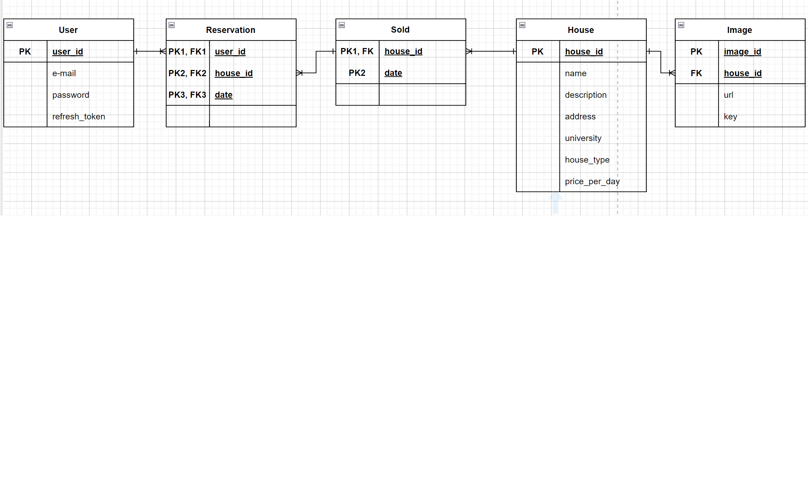

## Title

Enkor

## Description

### Application purpose

* 숙소 예약 기능을 제공하는 API. 

### Technologies
* Typescript
* NestJS
* SQLite
* TypeORM

### Details
* http://localhost:3000/ 에서 구동.
* 개발편의를 위해 dropSchema: true, synchronize: true,.

## DB
### ERD


### Description
* Reservation
  * 사용자가 특정 집을 언제 예약했는지에 대한 정보를 저장하기 위한 테이블.
  * PK: 하나의 예약에 대해 유일한 값을 보장해야 한다. 예약은 누가 언제 어떤 매몰을 예약했는지에 대한 정보가 필요하므로 "예약자","매물","날짜"에 따라 유일한 식별자가 필요하다. 따라서 Composite key로 PK를 구성하며 user_id, house_id, date가 그것이다.  
* Sold
  * 매물의 "판매" 정보를 저장하기 위한 테이블
  * PK: 하나의 판매에 대해 유일한 값을 보장해야 한다. 하나의 집은 여러번 팔릴 수 있지만, 같은 날짜에 같은 집이 중복으로 팔리는 경우는 없으므로 Composite key로 PK를 구성하며 house_id, date가 그것이다. (하나의 집은 여러개 팔릴 수 있어서 houseId로만 하면 유일한 값 보장 못함. 그러나 date를 추가해주면 유일한 값 보장)
* House
  * 매물의 정보를 저장하기 위한 테이블

* User: Reservation = 1:N
  * 하나의 User는 여러 개의 Reservation을 가질 수 있지만, 하나의 Reservation은 오직 하나의 User에만 속한다.
* Reservation:Sold = N:1
  * 각각의 판매는 여러 예약을 가질 수 있지만, 하나의 예약은 하나의 판매에만 연결되기 때문이다. (각 방은 여러예약을 가질 수 있지만, 하나의 예약은 하나의 방에만 연결된다)
* Sold:House = N:1
  * 하나의 집은 여러 번 팔릴 수 있기 때문. 그러나 한나의 Sold는 한개의 house에만 연결되기 때문.
* House:Image = 1:N
  * 하나의 집은 여러개의 이미지를 가질 수 있지만, 하나의 이미지는 한개의 house에만 연결된다. 

## Installation

```bash
$ npm run install
```

## Running the app

```bash
$ npm run start:dev 
```