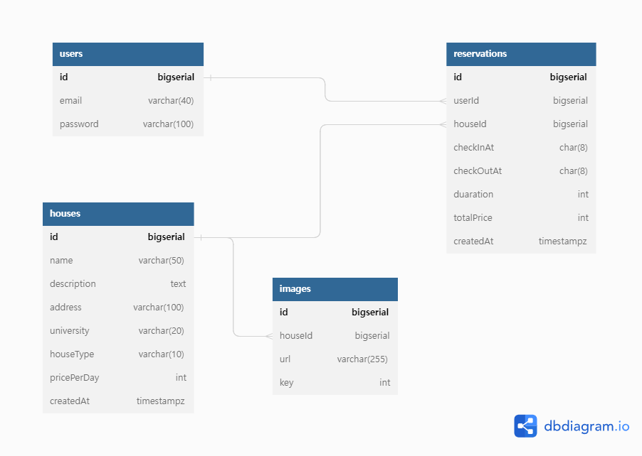

# enkor-bnb 김건우 과제 제출

## 1. ERD

## 2. 실행 방법
- DB 세팅을 위한 컨테이너 실행
  - docker compose up -d enkor_development 
- 의존성 설치
  - npm i
- development 환경으로 프로젝트 실행
  - npm run start:dev
- Unit Test
  - npm run test 또는 npm run test:watch

## 3. API 문서
- npm run start:dev로 프로젝트 실행 후 localhost:8000/api.docs로 접속

## 구현 기능
- 회원 기능
  - ✅ 회원 가입(회원가입 시 자동 로그인)
  - ✅ 로그인(세션 쿠키 기반의 jwt 인증)
  - ✅ 회원 가입 및 로그인은 이메일을 사용합니다.(email 검증 추가)
  - ✅ 비밀번호는 암호화 되어야 합니다.(bcrypt 사용)
  - ✅ JWT만을 이용해 인증기능이 구현되어야 합니다.
- 매물 조회 기능
  - ✅ 매물 정보: 타이틀, 주변대학, 매물 타입, 이미지 URL, 설명, 주소, 가격.
  - ✅ 사용자는 매물 리스트를 볼 수 있어야 합니다. 페이지네이션이 필요합니다. 리스트에는 타이틀, 주변대학, 이미지, 매물 타입, 가격이 나옵니다.
  - ✅ 사용자는 상품 리스트를 가격순으로 정렬할 수 있습니다.
  - ✅ 사용자는 상품 상세 정보를 볼 수 있어야 합니다.
- 숙박 예약
  - ✅ 사용자는 숙박 시설을 예약할 수 있어야 합니다.
  - ✅ 사용자는 예약한 내용을 확인할 수 있어야 합니다.
